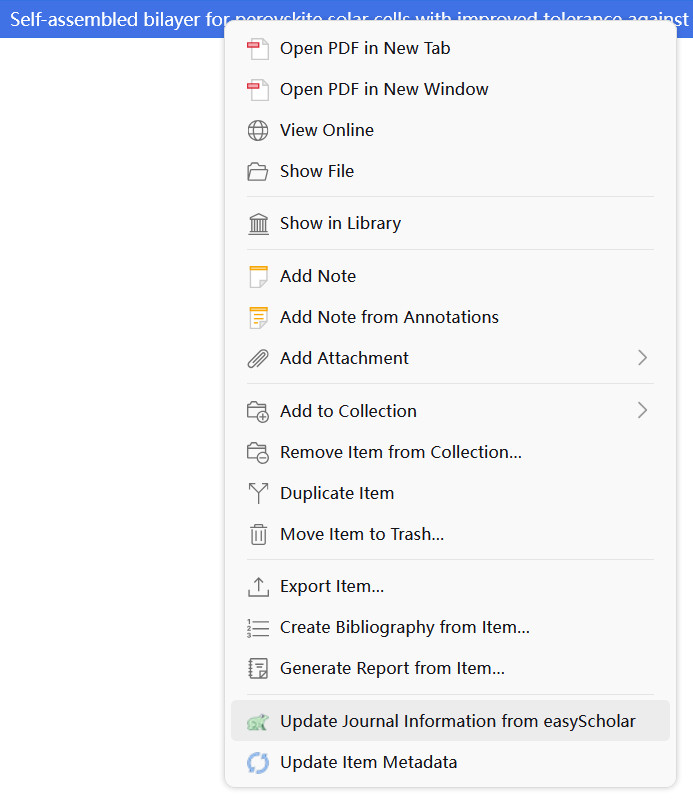
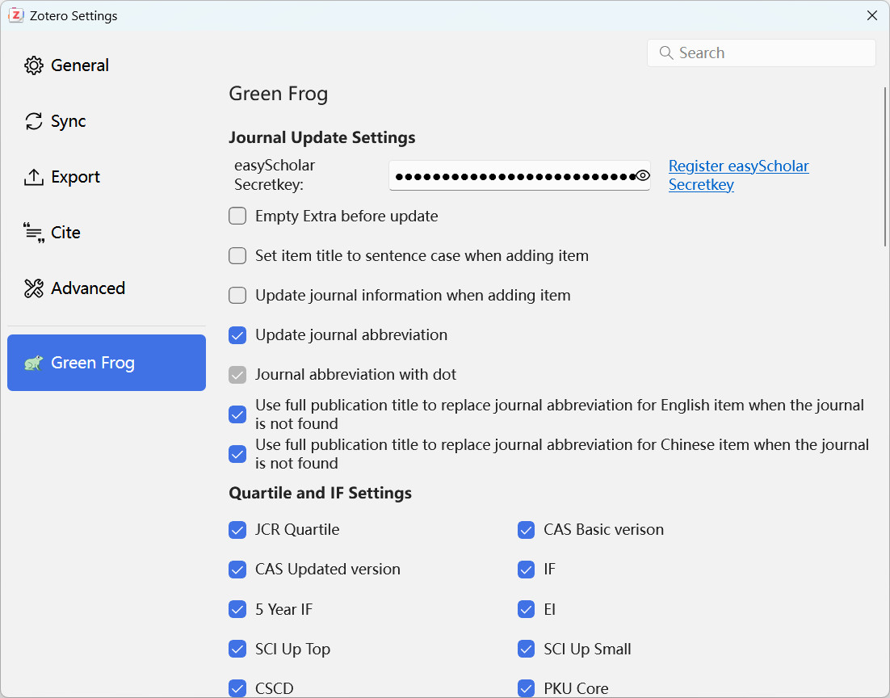
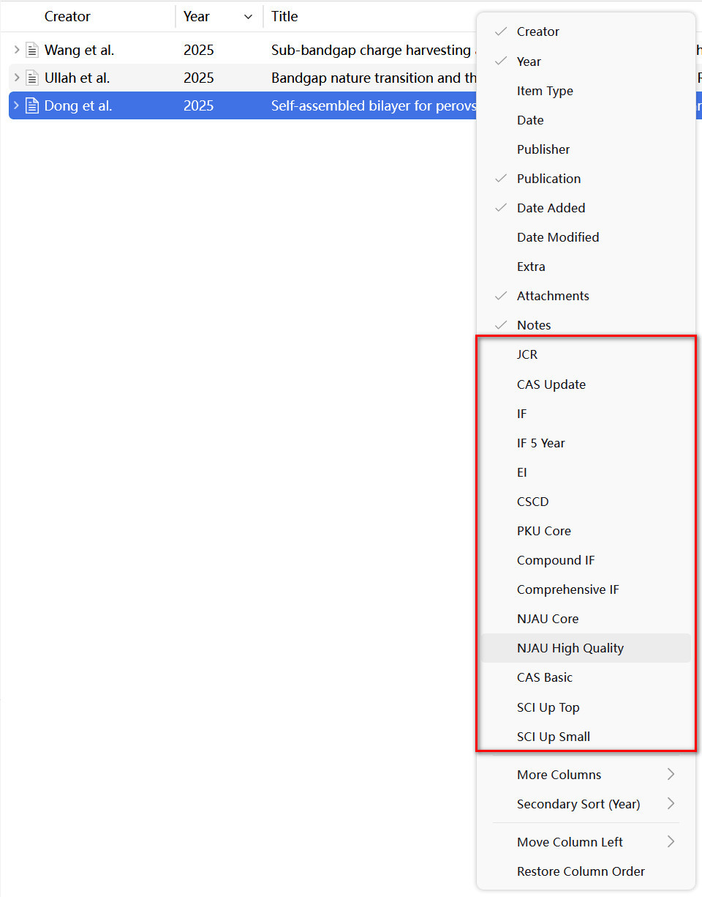
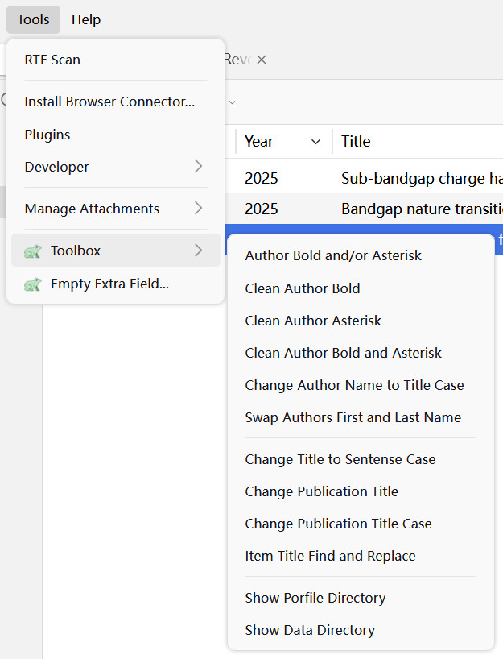

# Green Frog

感谢[easyScholar](https://easyscholar.cc)提供数据接口，[easyScholar](https://easyscholar.cc)是一个强大的浏览器插件，提供了很多有用期刊数据，详情访问：<https://easyscholar.cc>。感谢 @dawnlh 提供期刊缩写数据，感谢 @l0o0 提供的期刊缩写接口和中文期刊复合和综合影响子代码。

# 注意：

[最新版](https://github.com/redleafnew/zotero-updateifsE/releases/latest)仅支持Zotero 7.0及以上版本, Zotero 6.0请下载[0.13.0](https://github.com/redleafnew/zotero-updateifsE/releases/tag/0.13.0)。

## 主要功能

1. 更新期刊信息。
   - 点击分类及条目右键菜单中的`从easyScholar更新期刊信息`或使用快捷键（默认为`Ctrl+J`，可在设置中修改或停用快捷键）后，Green Frog插件根据条目语言从[easyScholar](https://easyscholar.cc)获取期刊信息等，具体包括：
      - 获取期刊或会议论文（需要将会议名称填入`Conference Name`字段）的`JCR分区`、`中科院分区基础版`、`中科院分区升级版`、`影响因子`和`5年影响因子`、`EI`、`中科院升级版Top分区`、`中科院升级版小类分区`、`中科院预警`等信息。
      - 获取中文期刊是否`EI`、`CSCD收录`、`北大/南大核心`、`科技核心`、`SSCI`、`AJG`、`UTD24`、`FT50`、`CCF`、`FMS`、`JCI`、`AHCI`、`ESI`、`复合影响因子`，`综合影响因子`，以及`南农大核心期刊`、`南农大高质量期刊`、各个大学对期刊的分类信息。
      - 基于[easyScholar](https://easyscholar.cc)自定义数据集（详见[easyScholar](https://easyscholar.cc)获取期刊信息）。
         - 如果要使用自定义数据集，需要在[easyScholar](https://easyscholar.cc)网站中登录，添加并在easyScholar浏览器插件中选中需要的自定义数据集。
   - 期刊信息保存在`我的文库`窗口右侧`信息`面板的`“其他”`字段中，如果显示不正常请先清空`“其他”`字段（点击`工具`-`清空“其他”字段...`即可）。
   - 可在`编辑`-`设置`-`绿青蛙`中设置哪些字段在列中显示（默认全部显示，如果不需要可以自行关闭），然后在列上右击并勾选即可显示相应字段。

   

   - 在`编辑`-`设置`-`绿青蛙`中设置要获取的期刊信息内容和显示的工具箱菜单：

   

   - 在列上右键设置显示的内容：

   

2. 更新条目元数据。
   - 可在`编辑`-`设置`-`绿青蛙`中开启`添加条目时更新元数据`，当添加条目时自动根据DOI(英文)或题目(中文)更新元数据。

3. 清空`“其他”`字段内容（`工具`-`清空“其他”字段...`）。

4. 给作者加粗、加星、清除加粗、清除加星；作者姓名改为词首字母大写；交换作者姓和名；将文献题目改为首字母大写；文献题目查找替换；更改期刊名称大小写；更改期刊名称；显示Zotero配置目录，显示Zotero数据目录等小工具（`工具`-`工具箱`）。

   - 在`工具`-`工具箱`显示：

   

5. 更新期刊缩写，带点或不带点。目前期刊缩写数据库只有5000多条数据，可以设置如果英语或中文条目期刊缩写查询不到时是否用全称代替（会根据语言字段进行判断，英语为`en`或`English`，中文为`ch`、`zh`、`中文`或`CN`），语言设置可以使用[Del ltem With Attachment插件](https://github.com/redleafnew/delitemwithatt)）。

## 安装方法

1. 点击下方链接下载插件.xpi文件，然后在Zotero或JurisM中通过工具-插件-Install Plugin From File...安装。

   - [最新版](https://github.com/redleafnew/zotero-updateifsE/releases/latest)
   - [历史版本](https://github.com/redleafnew/zotero-updateifsE/releases)

   *注意*：火狐浏览器用户请通过在链接上右击，选择“另存为”来下载 .xpi 文件。

2. 到[easyScholar](https://easyscholar.cc/)注册账号并登录，点击注册的用户名-`用户信息`-`开放接口`，复制密钥。在Zotero中点击`编辑`-`设置`-`绿青蛙`，粘贴到easyScholar密钥后的文本框内。

   

## 致谢

本插件基于 @windingwind 的[Zotero Plugin Template](https://github.com/windingwind/zotero-plugin-template)开发，在此表示感谢。

感谢 @windingwind 的开发工具箱，[Zotero Plugin Toolkit](https://github.com/windingwind/zotero-plugin-toolkit)。

---

# Reminder：

The [latest version](https://github.com/redleafnew/zotero-updateifsE/releases/latest) only supports Zotero 7.0 (or later versions), Zotero 6.0 users could download [0.13.0](https://github.com/redleafnew/zotero-updateifsE/releases/tag/0.13.0).

## Features

1. Update Journal Information from easyScholar.
   - Click `Update Journal Information from easyScholar` in the collection/item context menu, or trigger shortcut (default `Ctrl+J`, you can change or disable it in the Settings) to update the information of Journals, including:
     - Update `JCR Quartile`, `CAS Quartile`, `impact factor`, `5 year impact factor` and `EI` using name of the journal from [easyScholar](https://easyscholar.cc)
     - Update `JCR Quartile`, `CAS Quartile`, `EI`, `SCI Up Top`、`SCI Up Small`， `impact factor(IF)`, `5 year IF`, `CSCD`, `PKU Core`, `NJU Core`, `Sci & Tech Core`, `SSCI`, `AJG`, `UTD24`, `FT50`, `CCF`, `FMS`, `JCI`, `AHCI`, `CAS Warning`, `ESI`, `Compound IF`, `Comprehensive IF`, and some universities' journal category will be fetched from [easyScholar](https://easyscholar.cc) 
   - The Journal Information will be saved in `"Extra"` field.

2. Update item Metadata.
   - You can enable `Update item metadata when adding item` in `Edit`-`Settings`-`Green Frog`. When adding an item, the metadata will be updated automatically based on DOI (English) or Title (Chinese).

3. Empty `"Extra"` field content (`Tools`-`Empty "Extra" Field...`).

4. Bold, asterisk, remove bold, remove asterisk for author name; Change author name to title case; Swap author's first and last name; Change the item title to sentence case; Item title find and replace; Change publication title case; Change publication title; Show the Zotero profile and data directory (Use `Tools`-`Toolbox`).

5. Update journal abbreviation with or without dot.

## Installation

1. Download the plugin (.xpi file) from below, and click Tools-Plugins-Install Plugins From File... in Zotero or JurisM to install the plugin.

   - [Latest Version](https://github.com/redleafnew/zotero-updateifsE/releases/latest)
   - [All Releases](https://github.com/redleafnew/zotero-updateifsE/releases)

   *Note*: If you're using Firefox as your browser, right-click the `.xpi` and select "Save As.."

2. Register at [easyScholar](https://easyscholar.cc/) and log in，copy the secret key at user information, and paste to Green Frog Secretkey InputBox.

## Disclaimer

This plugin based on @windingwind's [Zotero Plugin Template](https://github.com/windingwind/zotero-plugin-template)，many thanks for his team's hard working.

We also acknowledge @windingwind's [Zotero Plugin Toolkit](https://github.com/windingwind/zotero-plugin-toolkit).

## License

Use this code under AGPL. No warranties are provided. Keep the laws of your locality in mind!
